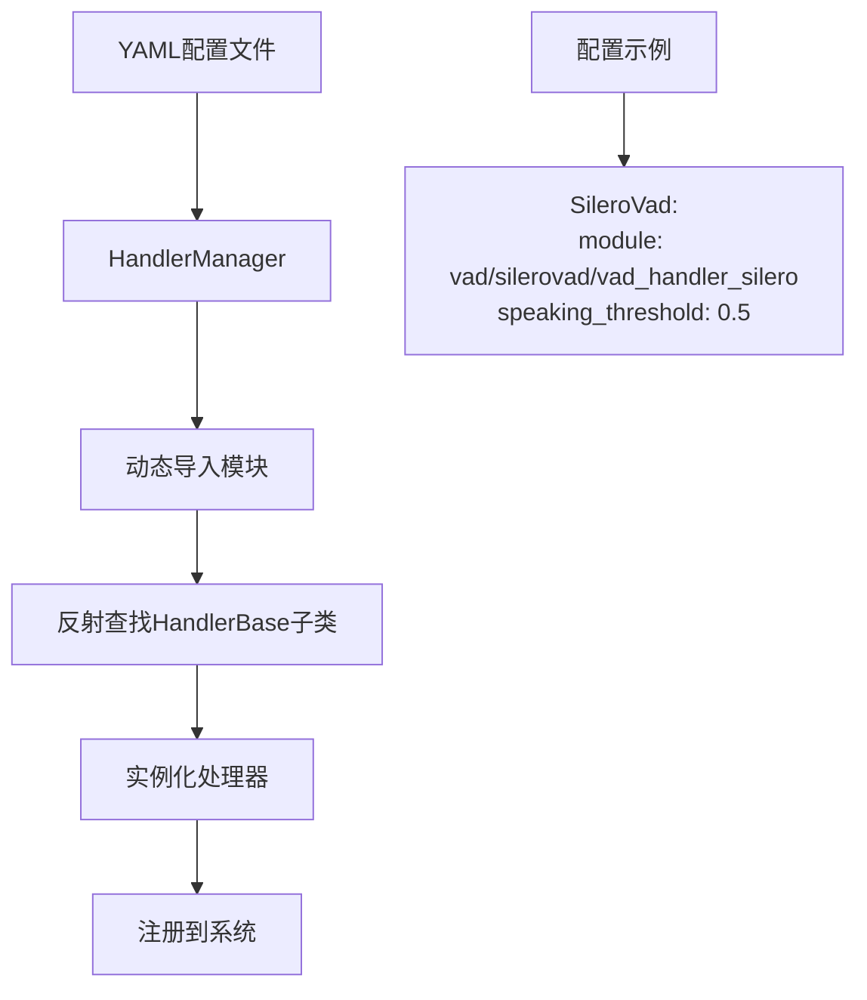
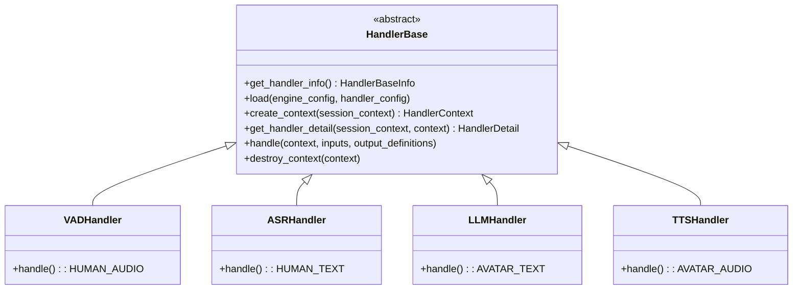
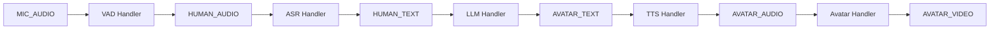
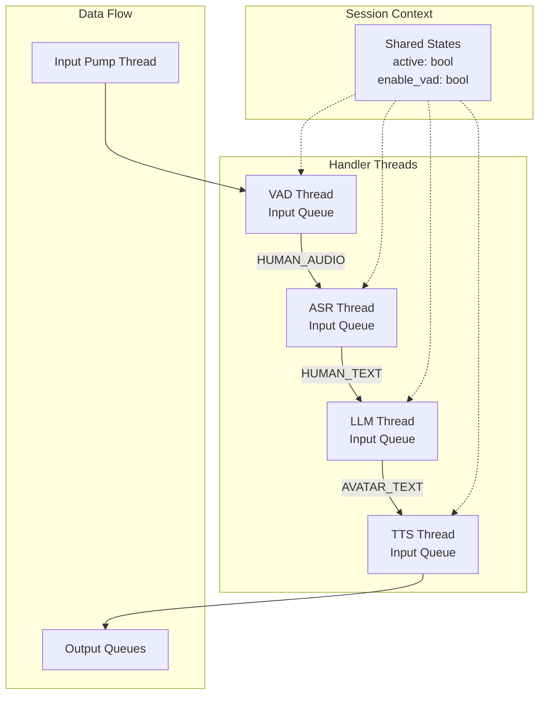
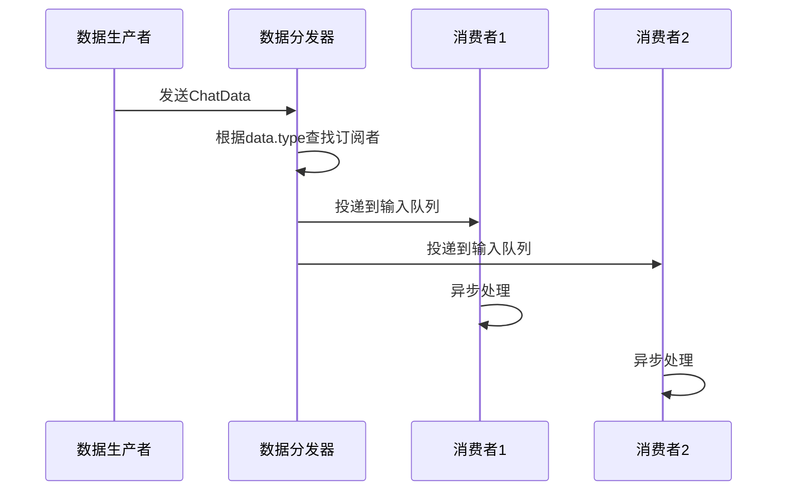
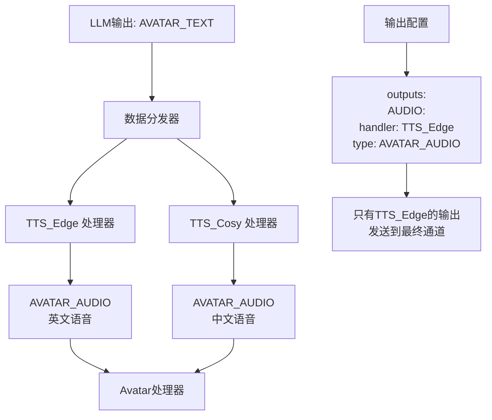

# OpenAvatarChat 架构设计文档

## 概述

OpenAvatarChat 采用了**插件化架构**和**管道式数据流**设计，通过配置驱动的方式实现模块化AI对话系统。系统支持多种模态（语音、视频、文本）的实时处理，并可以灵活组合不同的AI模型.

### 给新人的五分钟上手（TL;DR）
- 通俗理解：这套系统像“语音助手的流水线”。每个“工位”是一个处理器（VAD/ASR/LLM/TTS/Avatar），盒子上贴着“标签”（ChatDataType），标签决定它会被哪个工位接住。
- 三步就能看懂并动起来：
  1) 先看数据怎么流：MIC_AUDIO → HUMAN_AUDIO → HUMAN_TEXT → AVATAR_TEXT → AVATAR_AUDIO → AVATAR_VIDEO。
  2) 配置里启用/禁用工位：在 config/*.yaml 里按需开关处理器和参数（无需改代码）。
  3) 出问题先看日志关键词："Registered handlers"、"distributed to"、"processing took"。

### 核心概念速记（记住这些就够用）
- Handler（处理器）= 流水线工位，干一件事（如识别语音/生成文本）。
- ChatDataType（数据类型）= 盒子上的标签，决定哪个工位会接手这个盒子。
- 输入/输出声明 = 工位门口的“接收/产出清单”。
- 优先级与消费模式 = 排队规则。ONCE 表示只交给优先级最高的一个工位处理。
- Session Context = 公告板，放全局“是否运行”等共享状态。

### 最小工作流长啥样
- 麦克风音频（MIC_AUDIO）进 VAD → 得到人声片段（HUMAN_AUDIO）
- 人声片段进 ASR → 得到文字（HUMAN_TEXT）
- 文字进 LLM → 得到回复文字（AVATAR_TEXT）
- 回复文字进 TTS → 得到语音（AVATAR_AUDIO）
- 语音进 Avatar → 出视频（AVATAR_VIDEO）

## 核心设计模式

### 1. 配置驱动的组件加载 (Configuration-Driven Component Loading)

系统通过YAML配置文件动态加载和组装处理器，无需修改代码即可切换不同的AI模型组合。



**实现代码示例:**

```python
# src/chat_engine/core/handler_manager.py:48-89
for handler_name, raw_config in self.handler_configs.items():
    handler_config = HandlerBaseConfigModel.model_validate(raw_config)
    if not handler_config.enabled:
        continue
    
    # 动态导入模块
    module = importlib.import_module(module_input_path)
    
    # 反射查找HandlerBase子类
    for name, obj in inspect.getmembers(module):
        if issubclass(obj, HandlerBase):
            handler_class = obj
            break
    
    # 实例化并注册
    self.register_handler(handler_name, handler_class())
```

> 通俗理解：就像在配置单上勾选需要的“工位”，系统会自动把对应的模块搬到流水线上。

### 2. 基于接口的标准化处理器模式 (Interface-Based Handler Pattern)

所有处理器都继承自 `HandlerBase` 抽象基类，确保统一的生命周期管理和数据处理接口。



**处理器实现示例:**

```python
# src/handlers/vad/silerovad/vad_handler_silero.py:184-197
def get_handler_detail(self, session_context, context) -> HandlerDetail:
    inputs = {
        ChatDataType.MIC_AUDIO: HandlerDataInfo(type=ChatDataType.MIC_AUDIO)  # 声明接受麦克风音频
    }
    outputs = {
        ChatDataType.HUMAN_AUDIO: HandlerDataInfo(                           # 声明输出人声音频
            type=ChatDataType.HUMAN_AUDIO,
            definition=definition
        )
    }
    return HandlerDetail(inputs=inputs, outputs=outputs)
```

> 小提示：上面示例中的 `definition` 仅用于说明“输出的定义信息”，实际实现中可按需补充或省略。

> 通俗理解：所有工位的“接口高度统一”，所以可以随时替换同类工位（比如换一个 TTS），流水线仍然能跑。

### 3. 基于数据类型的自动管道串联 (Type-Based Pipeline Auto-Assembly)

系统根据处理器声明的输入输出数据类型自动构建处理管道，无需手动配置连接关系。



**数据类型定义:**

```python
# src/chat_engine/data_models/chat_data_type.py:6-21
class ChatDataType(Enum):
    MIC_AUDIO = ("mic_audio", EngineChannelType.AUDIO)      # 麦克风音频
    HUMAN_AUDIO = ("human_audio", EngineChannelType.AUDIO)  # 人声音频(经VAD处理)
    HUMAN_TEXT = ("human_text", EngineChannelType.TEXT)     # 人类文本(ASR输出)
    AVATAR_TEXT = ("avatar_text", EngineChannelType.TEXT)   # AI回复文本(LLM输出)
    AVATAR_AUDIO = ("avatar_audio", EngineChannelType.AUDIO) # AI语音(TTS输出)
    AVATAR_VIDEO = ("avatar_video", EngineChannelType.VIDEO) # 数字人视频(Avatar输出)
```

**自动连接机制:**

```python
# src/chat_engine/core/chat_session.py:335-341
io_detail = handler.get_handler_detail(self.session_context, handler_env.context)
inputs = io_detail.inputs

# 为每个输入类型注册数据接收点
for input_type, input_info in inputs.items():
    sink_list = self.data_sinks.setdefault(input_type, [])  # 按数据类型分组
    data_sink = DataSink(owner=handler_info.name, sink_queue=handler_env.input_queue, consume_info=input_info)
    sink_list.append(data_sink)  # 自动订阅对应数据类型
```

> 通俗理解：工位在“牌子”上写清楚要接哪种标签的盒子，调度员就会自动把匹配的盒子送到它的输入队列里。

### 4. 多线程异步处理架构 (Multi-threaded Async Processing)

每个处理器运行在独立线程中，通过队列进行异步通信，确保高并发和实时性。



**线程管理代码:**

```python
# src/chat_engine/core/chat_session.py:355-372
def start(self):
    self.session_context.shared_states.active = True
    
    # 每个处理器运行在独立线程
    for handler_name, handler_record in self.handlers.items():
        start_args = (self.session_context, handler_record.env, self.data_sinks, self.outputs)
        handler_record.pump_thread = threading.Thread(target=self.handler_pumper, args=start_args)
        handler_record.pump_thread.start()
    
    # 独立的输入数据泵线程
    input_pumper_args = (self.session_context, self.inputs, self.data_sinks, self.outputs)
    self.input_pump_thread = threading.Thread(target=self.inputs_pumper, args=input_pumper_args)
    self.input_pump_thread.start()
```

> 通俗理解：每个工位各忙各的，互相通过“盒子队列”传递，流水线能并行，速度就快。

## 数据流架构

### 数据分发机制



**分发实现:**

```python
# src/chat_engine/core/chat_session.py:276-289
@classmethod
def distribute_data(cls, data: ChatData, sinks, outputs):
    # 根据数据类型自动分发到对应的处理器
    sink_list = sinks.get(data.type, [])  # 找到订阅此数据类型的处理器
    for sink in sink_list:
        if sink.owner == data.source:
            continue  # 避免自循环
        sink.sink_queue.put_nowait(data)  # 投递到处理器的输入队列
        if sink.consume_info.input_consume_mode == ChatDataConsumeMode.ONCE:
            break  # 如果设置了ONCE模式，只给第一个处理器
```

> 小贴士：有多个同类工位时，默认“广播”给所有；若设置 ONCE，就只给优先级最高的那个（通常优先级数字越小越靠前）。

## 多处理器并行处理

### 场景：多个TTS处理器

当系统配置了多个相同类型的处理器时，默认采用**广播模式**，所有处理器并行处理相同数据。



### 优先级和消费模式控制

```python
# src/chat_engine/common/handler_base.py:30-39
class HandlerDataInfo:
    input_priority: int = 0  # 优先级，数字越小优先级越高
    input_consume_mode: ChatDataConsumeMode = ChatDataConsumeMode.DEFAULT

# 消费模式
class ChatDataConsumeMode(Enum):
    DEFAULT = 0  # 所有处理器都收到数据
    ONCE = -1    # 只有第一个（优先级最高）处理器收到数据
```

## 新开发者快速入门

### 1. 创建新的处理器

```python
# 继承HandlerBase并实现必要方法
class MyCustomHandler(HandlerBase):
    def get_handler_info(self) -> HandlerBaseInfo:
        return HandlerBaseInfo(config_model=MyCustomConfig)
    
    def load(self, engine_config, handler_config):
        # 加载模型或初始化资源
        pass
    
    def create_context(self, session_context, handler_config) -> HandlerContext:
        # 创建会话上下文
        return MyCustomContext(session_context.session_info.session_id)
    
    def get_handler_detail(self, session_context, context) -> HandlerDetail:
        # 声明输入输出数据类型
        return HandlerDetail(
            inputs={ChatDataType.INPUT_TYPE: HandlerDataInfo(type=ChatDataType.INPUT_TYPE)},
            outputs={ChatDataType.OUTPUT_TYPE: HandlerDataInfo(type=ChatDataType.OUTPUT_TYPE)}
        )
    
    def handle(self, context, inputs, output_definitions):
        # 核心处理逻辑
        # 处理 inputs.data，生成输出
        yield output_data  # 支持生成器模式
```

### 2. 配置文件添加处理器

```yaml
# config/my_config.yaml
default:
  chat_engine:
    handler_configs:
      MyHandler:
        enabled: True
        module: my_module/my_handler  # 模块路径
        custom_param: "value"         # 自定义参数
```

### 3. 处理器目录结构

```
src/handlers/
├── my_category/
│   ├── __init__.py
│   ├── my_handler/
│   │   ├── __init__.py
│   │   ├── my_handler.py          # 处理器实现
│   │   └── pyproject.toml         # 模块依赖
│   └── pyproject.toml
```

### 4. 调试和测试

```python
# 查看处理器是否正确注册
logger.info(f"Registered handlers: {list(self.handler_registries.keys())}")

# 查看数据流
logger.info(f"Data type {data.type} from {data.source} distributed to {len(sink_list)} handlers")

# 查看处理器状态
logger.info(f"Handler {handler_name} processing took {duration}ms")
```

## 最佳实践

### 1. 处理器设计原则
- **单一职责**: 每个处理器只处理一种特定任务
- **无状态设计**: 尽量避免处理器间的状态依赖
- **异常处理**: 妥善处理异常，避免影响整个管道

### 2. 性能优化
- **合理设置优先级**: 避免不必要的并行处理
- **使用生成器**: 支持流式处理，提升响应速度
- **资源管理**: 及时释放GPU内存和其他资源

### 3. 配置管理
- **模块化配置**: 不同部署环境使用不同配置文件
- **参数验证**: 使用Pydantic进行配置参数验证
- **环境变量**: 敏感信息通过环境变量管理

## 术语对照表（Glossary）
- VAD（Voice Activity Detection）: 语音活动检测，找到人声片段。
- ASR（Automatic Speech Recognition）: 语音识别，把语音转成文字。
- LLM（Large Language Model）: 大语言模型，生成回复文字。
- TTS（Text To Speech）: 文转语，把文字读出来。
- Avatar: 数字人/视频合成模块，把语音变成视频表现。
- ChatDataType: 数据的“标签”，用于自动路由。
- Handler: 处理器/工位，声明它接什么、出什么。

## 常见问题速查（FAQ）
- 为什么我的处理器没有收到数据？
  - 检查它声明的输入 ChatDataType 是否与上游输出一致；查看日志里是否“distributed to 0 handlers”。
- 设置了 ONCE 为什么好像还是多个都收到了？
  - ONCE 只会把数据交给优先级最高的处理器，确认优先级设置（数字越小优先级越高）。
- 我能不能只改配置就换模型？
  - 可以，处理器遵循统一接口。只需在 YAML 里切换 module 和参数。

## 总结

OpenAvatarChat的架构设计具有以下优势：

1. **高度模块化**: 通过插件化架构实现组件解耦
2. **配置驱动**: 无需修改代码即可灵活组合不同AI模型
3. **类型安全**: 强类型数据模型确保数据流正确性
4. **高并发**: 多线程异步处理保证实时性能
5. **易扩展**: 标准化接口让新功能开发变得简单

这种设计模式特别适合构建复杂的AI对话系统，能够有效应对不同场景的需求变化.